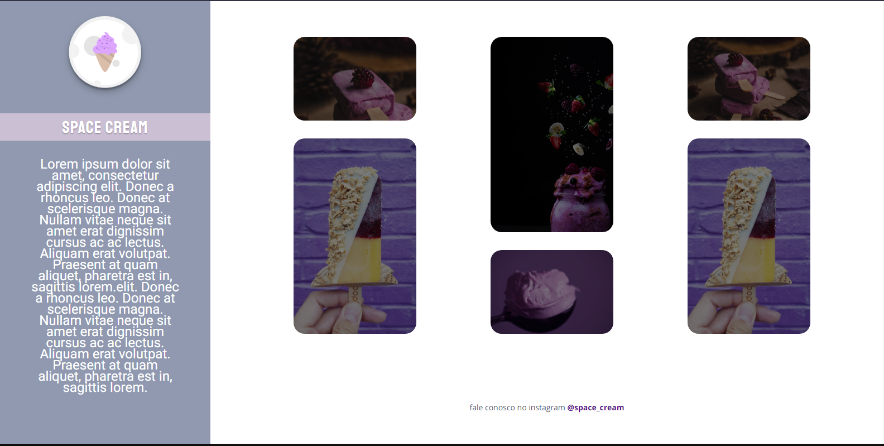
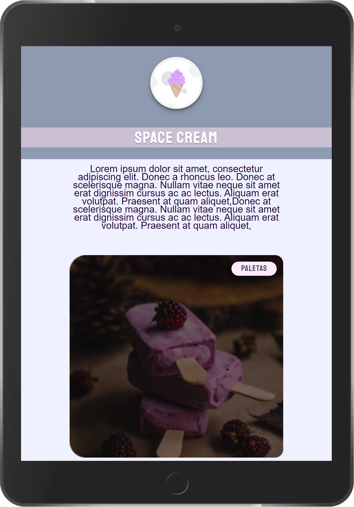

<h1 align="center">
	Explorer-Stage03-CSS-Desafio Grid com animações
</h1>

<h3 align="center">
	Projeto desenvolvido na  formação explorer da rocketseat
</h3>&nbsp;

<h4 align="center">
	Status: 🚀 Finished
</h4>

	<a href="#sobre">Sobre</a> •
	<a href="#funcionalidades">Funcionalidades</a> •
	<a href="#tecnologias">Tecnologias</a> •
	<a href="#autor">Autor</a> 

## Sobre

Desafios proposto pelo programa de formação explorer da rocketseat, onde foi proposto replicarmos um layout usando Grid para alinharmos os elementos, animações e transições e media queries para adaptarmos o layout a vários tipos de tela

## Funcionalidades

- [x] Alinhamento dos elementos usando Flexbox e GRID
- [x] Animações nos elementos da pagina.

## Tecnologias

&nbsp;
&nbsp;

## Imagens

&nbsp;&nbsp;&nbsp;&nbsp;&nbsp;&nbsp;&nbsp;&nbsp;&nbsp;&nbsp;&nbsp;&nbsp;&nbsp;&nbsp;&nbsp;&nbsp;&nbsp;&nbsp;&nbsp;&nbsp;&nbsp;&nbsp;

## Autor

Criado por [Willian Amaro Gomes](https://github.com/williangomesdev)

&nbsp;
&nbsp;
 
